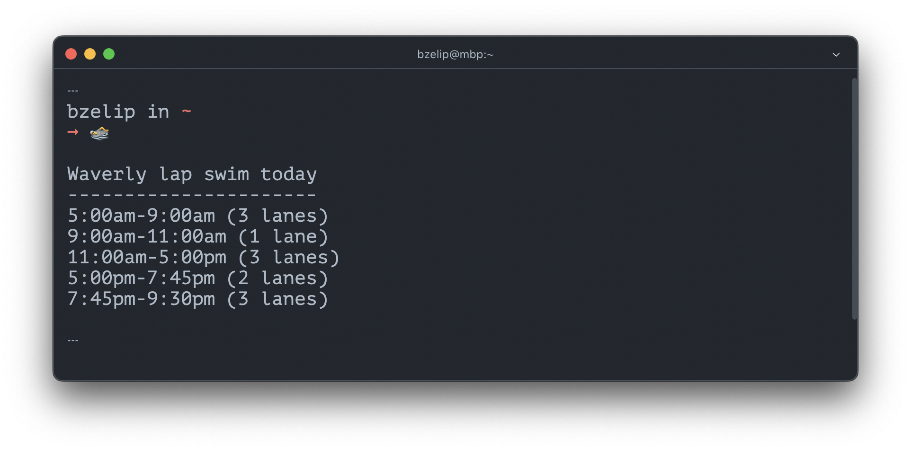

# Lapswim

Today's lap swim schedule\* in the macOS menu bar†.



\* At the Waverly and Towson Ys in Baltimore

† Currently cli only

## Code provenance

```sh
# init cli choices:
# - JS/!TS
# - tests/ dir
# - do not auto install 3 browsers
npm init playwright@latest

# Install only Firefox
npx playwright install firefox

# Run tests headless
npx playwright test

# Run tests in UI mode
npx playwright test --ui
```

## Contributing

Open a PR!

## Author

Brian Zelip, https://zelip.me

## License

GPLv3
