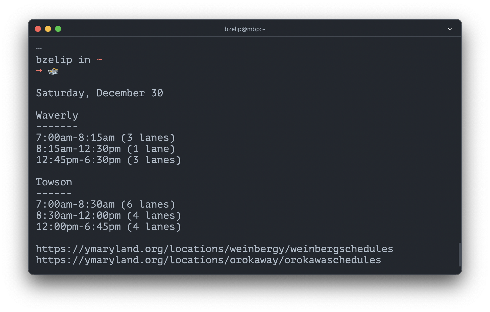

# Lapswim


Today's lap swim schedule at Baltimore's Waverly and Towson Ys in the terminal.



Schedules are scraped with [Playwright](https://playwright.dev/), logged to stdout, and cached in a local json file for the day. The app is ran automatically by launchd on login and every 5 minutes.

## Usage

1. Clone this repo
2. Install dependencies

```sh
npm i
```

3. Copy the sample plist file to your user agent directory and rename it

```sh
cp ./src/local.lapswim.plist.sample ~/Library/LaunchAgents/local.lapswim.plist
```

4. Edit the `Program` and `StandardErrorPath` key values in ~/Library/LaunchAgents/local.lapswim.plist so the paths correspond to your machine
5. Load the plist file with launchd

```sh
launchctl load ~/Library/LaunchAgents/local.lapswim.plist
```

6. Set an alias in your terminal config file

```sh
# .zshrc, .bashrc, etc
alias swim='node ~/Code/lapswim/src/lapswim.mjs'
```

7. Open a new terminal and run the `swim` alias to get today's lap swim times!

```sh
swim

> Saturday, December 2
>
> Waverly
> -------
> 7:00am-8:15am (3 lanes)
> 8:15am-12:30pm (1 lane)
> 12:30pm-6:30pm (3 lanes)
>
> Towson
> ------
> 7:00am-8:30am (6 lanes)
> 8:30am-12:00pm (4 lanes)
> 12:00pm-6:45pm (4 lanes)
>
> https://ymaryland.org/locations/weinbergy/weinbergschedules
> https://ymaryland.org/locations/orokaway/orokawaschedules
```

## Resources

- [`launchd` tutorial](https://launchd.info/)
- [launchd.plist man page](https://keith.github.io/xcode-man-pages/launchd.plist.5.html)
- https://8thlight.com/insights/tutorial-add-a-menu-bar-extra-to-a-macos-app
- [Tauri menubar app template](https://github.com/4gray/tauri-menubar-app) - Vite and Vue, app shows in dock and `alt + tab`
  - https://betterprogramming.pub/create-menubar-app-with-tauri-510ab7f7c43d
- [Build a Menubar app with Tauri](https://www.youtube.com/watch?v=Jm5dzewv3gA)
  - [source code](https://github.com/rust-adventure/yt-tauri-menubar-example)
- [Build A Menu Bar App With Python & Rumps](https://www.youtube.com/watch?v=TW6VEywhtT4) (no audio)
- [Create a mac menu bar app in SwiftUI with MenuBarExtra](https://sarunw.com/posts/swiftui-menu-bar-app/)
- [Building macOS Menu Bar Stocks App Using SwiftUI](https://www.youtube.com/watch?v=cA-oUgOfLxY)
- [Building a ChatGPT macOS toolbar app using SwiftUI](https://www.youtube.com/watch?v=v6SMV_TUOJk)
- [Creating Menu Bar App in macOS Using AppKit](https://www.youtube.com/watch?v=uszImMe0CsU)
- [SwiftUI](https://developer.apple.com/documentation/swiftui)
- [AppKit](https://developer.apple.com/documentation/appkit)
- [Electron Tray tutorial](https://www.electronjs.org/docs/latest/tutorial/tray)

## Contributing

Open a PR!

## Author

Brian Zelip, https://zelip.me

## License

GPLv3
